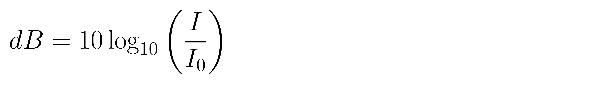

# MathBridge Demo page

## ASR pipeline demo

### 1. Youtube Math lecture
link : https://  
audio:
!audio[audio1](audios/audio_output_0.wav){ size=10 duration=10 cycle=forever }

<audio controls>
  <source src="audios/audio_output_0.wav" type="audio/mpeg">
  Your browser does not support the audio element.
</audio>

 
latex: 
rendered image:

### 2. Youtube Math lecture
link : https:// 
audio: 
latex: 
rendered image:

### 3. Youtube Math lecture
link : https:// 
audio: 
latex: 
rendered image:
* * *
## TTS pipeline demo

### 1. Math textbook
image: 
audio: 

### 2. Math textbook
image: 
audio: 

### 3. Math textbook
image: 
audio: 
